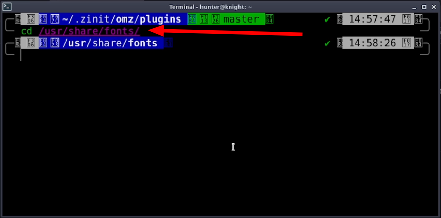
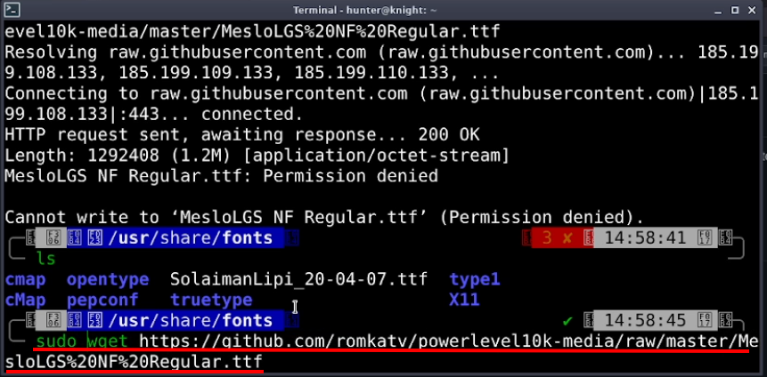

<h2 align="center">Make your Command line / Terminal more colourful to use it energetic</h2>

## Start from here:

    sudo apt-get update -y && sudo apt-get upgrade -y

## Step 1:
Past this command on your terminal and Hit <kbd>Enter</kbd>

    bash -c "$(wget -qO- git.io/zsh.sh)"

## Step 2:
 
No need to type anything, just Press <kbd>Enter</kbd>

## Step 3:
 
Just Press <kbd>Enter</kbd>

## Step 4:
 
Just Press <kbd>Enter</kbd>

## Step 5:
 
Type your local computer password and Hit <kbd>Enter</kbd>

## Step 6:
 
Again type your local computer password and Hit <kbd>Enter</kbd>

## Step 7:
 
Just Press <kbd>Enter</kbd>

## Step 8:
 
Now Choose the number of theme. In Mycase it's `171` number theme. After choose theme Hit <kbd>Enter</kbd>

## Step 9:
 
Now just Press <kbd>q</kbd> from your Keyboard

## You're almost done!! after coming this stage
As you can see here the Terminal looking very worst, We have to make it beautiful
 

## Step 10:
Now go to [this](https://github.com/romkatv/powerlevel10k/blob/master/font.md) page and `copy` the font download link.

## Step 11:
 
Now go to `fonts` directory by `cd` command

    cd /usr/share/fonts/

## Step 12:
 
Pest this command into your terminal and Hit <kbd>Enter</kbd>

    sudo wget https://github.com/romkatv/powerlevel10k-media/raw/master/MesloLGS%20NF%20Regular.ttf

## Step 13:
 
Now give this command and see your downloaded font name `MesloLGS NF Regular`

    ls

## Step 14:
 
Now clear the terminal by this command

    clear

## Step 15:
 
`Right` click on mouse and go to `Preferences` 

### Go to `Appearance` tab. Make sure uncheck `Use system font`. Click on `font name`, in Mycase it's `Monospace Regular` 

## Step 16:
Now search `MesloLGS` and click to `select` this font
 
After selected font click `Close` to quite this Preferences

Now it's look like:
 

## Now switch to `root user`

    sudo su
 
## Run this command again
    bash -c "$(wget -qO- git.io/zsh.sh)"

This time previous all steps are same and password will not required.

## Final step:
After finish all process type this command

    sudo reboot

<h1 align='center'>Best of luck</h1>